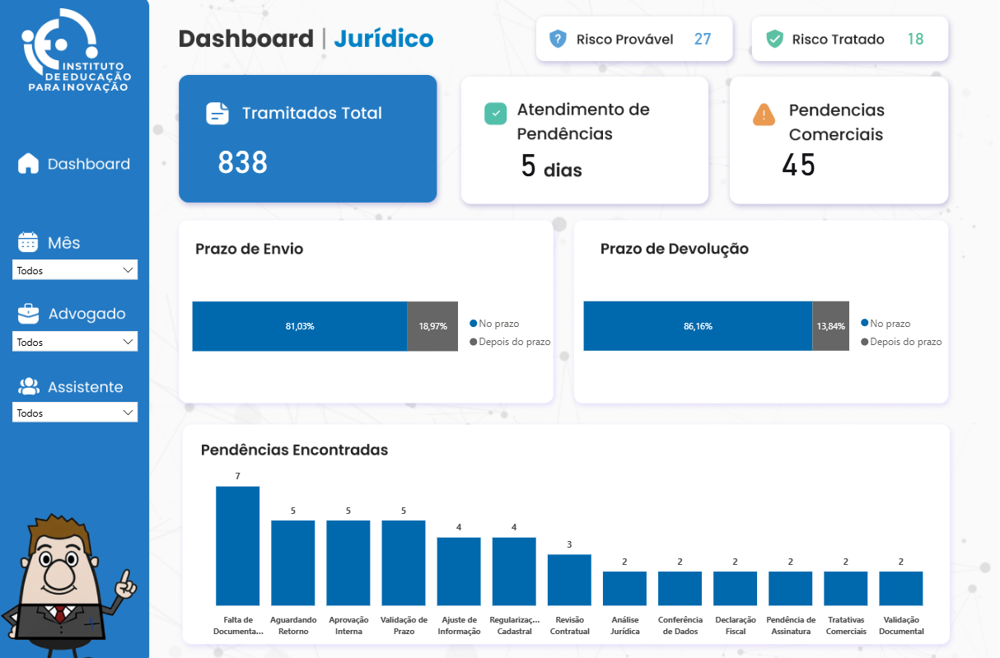

# 📊 Dashboard de Análise de Trâmites Jurídicos

> 🔒 **Dados anonimizados:** Este projeto utiliza dados tratados e anonimizados para garantir a confidencialidade das informações, em conformidade com a LGPD.

## 📷 Preview do Dashboard

🔗 **Dashboard publicado no Power BI:** [Visualizar Dashboard](SEU_LINK_AQUI)

---

## 🎯 Objetivo

Este projeto consiste no desenvolvimento de um dashboard interativo no Power BI voltado à análise descritiva de trâmites jurídicos.

O objetivo é apoiar a tomada de decisão por meio de dados, permitindo o acompanhamento de prazos, identificação de gargalos operacionais, monitoramento de pendências e análise de riscos ao longo do tempo.

---

## 🛠️ Ferramentas Utilizadas

* Power BI (visualização de dados)
* Excel (tratamento e estruturação dos dados)

---

## 📊 Principais Métricas

* 📄 Total de processos
* ⏱️ Prazos de assinaturas e devoluções
* ⚠️ Total de pendências
* 🚨 Indicadores de risco (tratados e prováveis)

---

## 📈 Análises Realizadas

O dashboard permite a análise dos trâmites jurídicos sob diferentes perspectivas:

* 📅 Evolução ao longo dos meses
* 👨‍⚖️ Advogados responsáveis
* 👩‍💼 Assistentes responsáveis
* ⏳ Status de prazos (no prazo / fora do prazo)
* ⚠️ Tipos de pendências
* 🚨 Status de tratamento de riscos

---

## 🔍 Tratamento de Dados

Os dados utilizados neste projeto foram anonimizados para garantir a confidencialidade das informações.

Principais etapas:

* Limpeza e padronização dos dados
* Tratamento de inconsistências
* Organização das tabelas para análise

---

## 💡 Principais Insights

* Identificação de atrasos em assinaturas e devoluções
* Mapeamento de responsáveis com maior volume de pendências
* Análise dos principais tipos de pendências
* Monitoramento de riscos e status de tratamento
* Identificação de gargalos no fluxo operacional

---

## ⚠️ Considerações

Este projeto foi desenvolvido com base em um cenário real, com dados anonimizados conforme a LGPD, sendo utilizado para fins de demonstração de habilidades em análise de dados.
